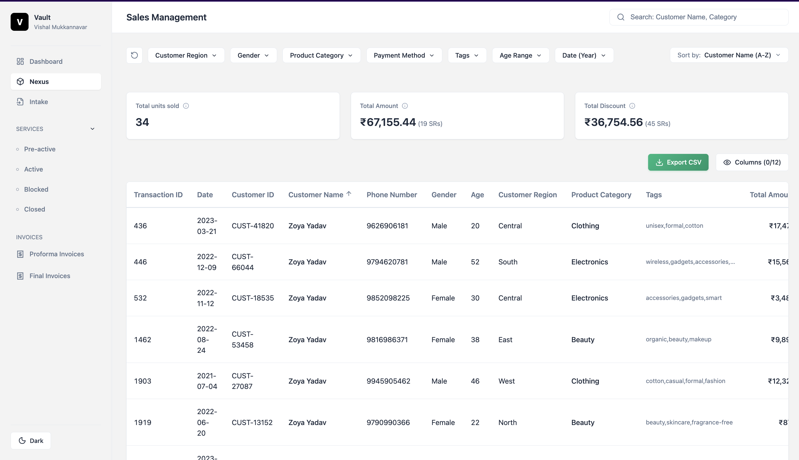
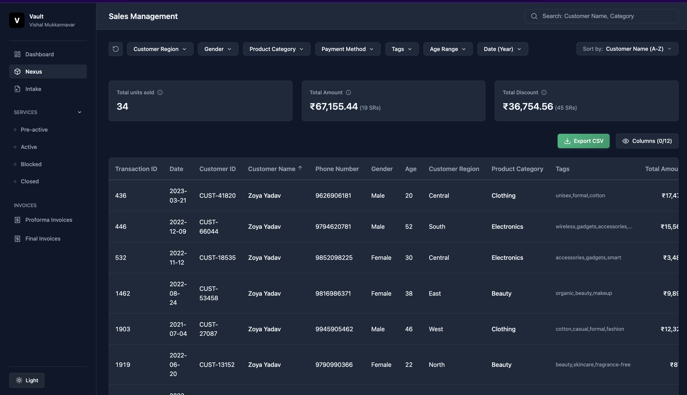

# TruEstate - Retail Sales Management System

## Live Demo

[View Live Application](https://vishalstate.netlify.app/)

A modern, full-stack Retail Sales Management dashboard built with React 19, Node.js, and Express. This application handles over 1 million sales transactions with instant search, advanced filtering, real-time analytics, and seamless data export capabilities.

## Screenshots

### Light Mode



### Dark Mode



## Features

### Dashboard & Analytics

- Overview Dashboard: Clean welcome view with system status and quick links
- Real-Time Stats Cards: Dynamic aggregation of Total Units Sold, Total Amount, and Total Discount based on active filters
- Instant Updates: Stats refresh automatically when filters are applied

### Advanced Search & Filtering

- Multi-Term Search: Intelligent search across Customer Name, Phone Number, Product Name, and Product Category with AND logic
- Debounced Input: 300ms delay prevents excessive API calls while typing
- 8 Filter Types:
  - Region: Multi-select (North, South, East, West, Central)
  - Gender: Male, Female
  - Category: Electronics, Clothing, Beauty
  - Payment Method: UPI, Credit Card, Debit Card, Cash, Net Banking, Wallet
  - Tags: Dynamic options from dataset (wireless, organic, casual, etc.)
  - Age Range: Min/Max filters (18-65)
  - Date Range: Year-based filtering (2021-2023)
- Filter Combination: All filters work together seamlessly
- One-Click Reset: Clear all filters and search instantly

### Data Table & Sorting

- Responsive Table: 12 customizable columns displaying comprehensive transaction details
- Smart Sorting: Dedicated dropdown for sorting by Date, Customer Name, Quantity, Total Amount
- Correct Numeric Sorting: Properly handles numbers, dates, and text (no alphabetical bugs)
- Column Visibility: Show/hide any of the 12 columns with persistent preferences

### Pagination & Navigation

- Intelligent Pagination: Smart ellipsis notation (1 ... 5 6 7 ... 100,000)
- Quick Jump: "Go to Page" feature for instant navigation
- 100,000+ Pages: Handles massive datasets smoothly
- 10 Records Per Page: Optimized for performance and readability

### Data Export

- CSV Export: Download filtered results with one click
- Smart Naming: Filenames include timestamp and filter status
- Proper Formatting: Handles commas, quotes, and special characters correctly
- Filtered Export: Export exactly what you see on screen

### User Experience

- Dark Mode: Full dark theme with persistent localStorage preferences
- Theme Toggle: Switch between light and dark modes instantly
- Responsive Design: Mobile-friendly interface with touch-optimized controls
- Loading States: Skeleton loaders for smooth user experience
- Error Handling: Clear error messages for invalid inputs

---

## Tech Stack

### Frontend

- React 19: Latest features with enhanced hooks and concurrent rendering
- Vite 6: Lightning-fast development server with HMR
- CSS Modules: Component-scoped styling with zero conflicts
- Axios: Clean HTTP client for API integration
- Lucide React: Modern, scalable SVG icon library
- Custom Hooks: useDebounce for optimized performance

### Backend

- Node.js 22: Latest LTS with enhanced performance
- Express 5: Minimal, flexible web framework
- csv-parser: Efficient CSV data ingestion
- CORS: Configured for cross-origin requests
- Supabase Support: Optional PostgreSQL database integration

### Development Tools

- ESLint: Code quality and consistency
- Git: Version control
- npm: Dependency management

### Performance Optimizations

- In-memory data processing for <100ms queries
- Debounced search (300ms)
- Lazy pagination (10 records per request)
- LocalStorage caching for user preferences
- Efficient O(N) filtering algorithms

---

## Getting Started

### Prerequisites

- Node.js: v20.19+ or v22.12+ (required for Vite)
- npm: v10+ (comes with Node.js)

### Installation

1.  Clone the repository:

    ```bash
    git clone https://github.com/Vishal-Github-21/project-vishal.git
    cd TruEstate
    ```

2.  Setup Backend:

    ```bash
    cd backend
    npm install
    ```

3.  Setup Frontend:
    ```bash
    cd ../frontend
    npm install
    ```

### Running the Application

You need to run two separate terminals (one for backend, one for frontend).

Terminal 1 (Backend):

```bash
cd backend
npm start
# Server runs on http://localhost:5001
```

Terminal 2 (Frontend):

```bash
cd frontend
npm run dev
# App runs on http://localhost:5173
```

---

## Project Structure

```
TruEstate/
├── backend/
│   ├── data/                   # Place CSV file here
│   ├── src/
│   │   ├── controllers/        # Logic for Search, Sort, Filter
│   │   ├── utils/              # CSV Parsing logic
│   │   └── index.js            # Express Server entry
│   └── package.json
│
└── frontend/
    ├── src/
    │   ├── components/         # Reusable UI Components
    │   │   ├── Sidebar         # Navigation
    │   │   ├── FilterBar       # Complex Filtering
    │   │   ├── Pagination      # Advanced Paging
    │   │   ├── SalesTable      # Data Display
    │   │   └── ...
    │   ├── App.jsx             # Main Layout & State
    │   └── styles/             # Global CSS
    └── package.json
```

## Live Demo

- Frontend (Netlify): https://vishalstate.netlify.app
- Frontend (Vercel): https://project-vishal.vercel.app
- Backend API: https://project-vishal.vercel.app/api/sales

## Key Metrics

- Dataset Size: 1,000,000+ sales transactions
- Response Time: <100ms for filtered queries
- Pagination: 100,000+ pages supported
- Filter Options: 8 different filter types
- Search Fields: 4 searchable columns
- Export Capacity: Unlimited filtered records

## Use Cases

1. Sales Analysis: Identify regional sales trends and top-performing categories
2. Customer Segmentation: Filter by demographics (age, gender, region)
3. Revenue Tracking: Monitor total amounts and discounts by payment method
4. Product Performance: Analyze sales by category and tags
5. Time-Series Analysis: Track sales patterns across different years
6. Business Intelligence: Export filtered data for executive reporting

## Future Enhancements

- User Authentication: Role-based access (Sales Agents, Managers, Admins)
- Data Visualization: Interactive charts and graphs (Recharts/Chart.js)
- Advanced Analytics: Predictive sales forecasting
- Real-Time Sync: WebSocket integration for live updates
- Multi-Language: i18n support for global teams
- PDF Reports: Generate formatted reports with charts

## Project Structure

```
TruEstate/
├── backend/
│   ├── data/                          # CSV dataset
│   │   └── truestate_assignment_dataset.csv
│   ├── src/
│   │   ├── controllers/               # Business logic
│   │   │   ├── salesController.js     # CSV-based controller
│   │   │   └── salesController.supabase.js  # Database controller
│   │   ├── db/                        # Database configuration
│   │   │   ├── supabase.js
│   │   │   └── supabase-schema.sql
│   │   ├── routes/                    # API routes
│   │   │   └── salesRoutes.js
│   │   ├── utils/                     # Utilities
│   │   │   └── dataProcessor.js
│   │   └── index.js                   # Server entry point
│   └── package.json
│
└── frontend/
    ├── public/                        # Static assets
    ├── src/
    │   ├── components/                # React components
    │   │   ├── ColumnToggle.jsx
    │   │   ├── Dashboard.jsx
    │   │   ├── ExportButton.jsx
    │   │   ├── FilterBar.jsx
    │   │   ├── FilterPanel.jsx
    │   │   ├── LoadingSkeleton.jsx
    │   │   ├── Pagination.jsx
    │   │   ├── SalesTable.jsx
    │   │   ├── SearchBar.jsx
    │   │   ├── Sidebar.jsx
    │   │   ├── SortDropdown.jsx
    │   │   ├── StatsCards.jsx
    │   │   └── ThemeToggle.jsx
    │   ├── hooks/                     # Custom hooks
    │   │   └── useDebounce.js
    │   ├── services/                  # API services
    │   │   └── api.js
    │   ├── styles/                    # Global styles
    │   │   └── global.css
    │   ├── App.jsx                    # Main app component
    │   └── main.jsx                   # Entry point
    └── package.json
```

## Developer

Vishal Maruti Mukkannavar

- GitHub: @Vishal-Github-21
- Repository: github.com/Vishal-Github-21/project-vishal

## License

This project is developed as part of an assignment demonstrating full-stack development capabilities.

---

Built with React, Node.js, and modern web technologies
